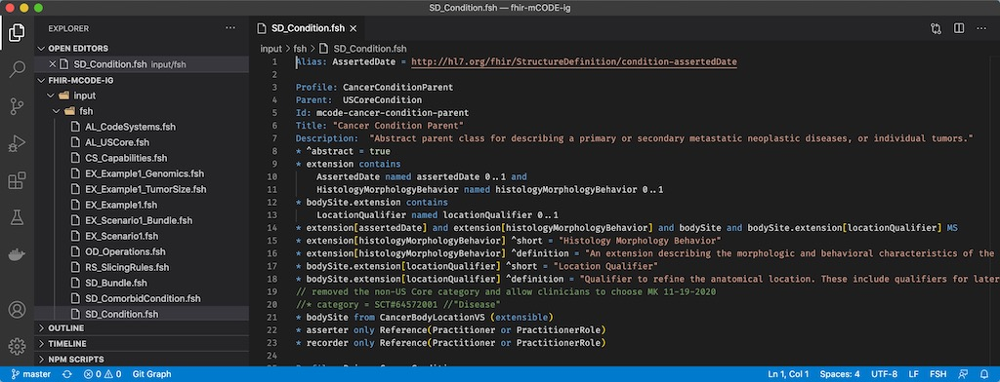
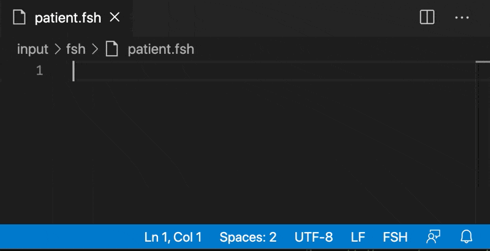
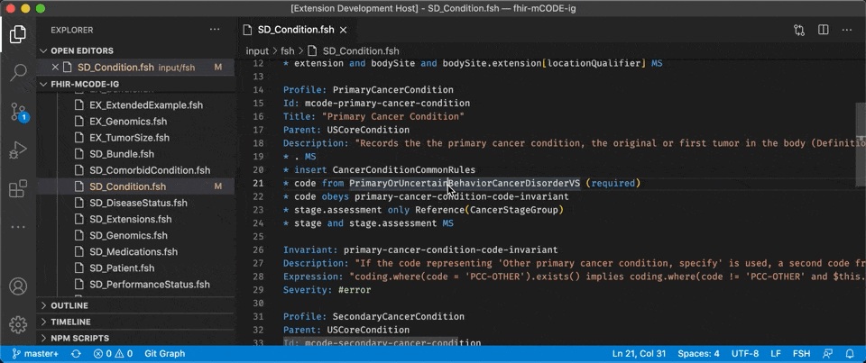
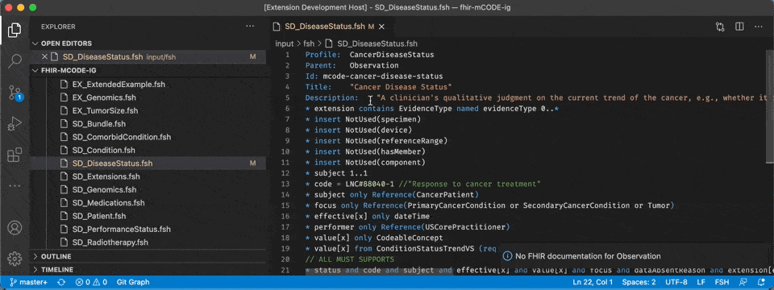
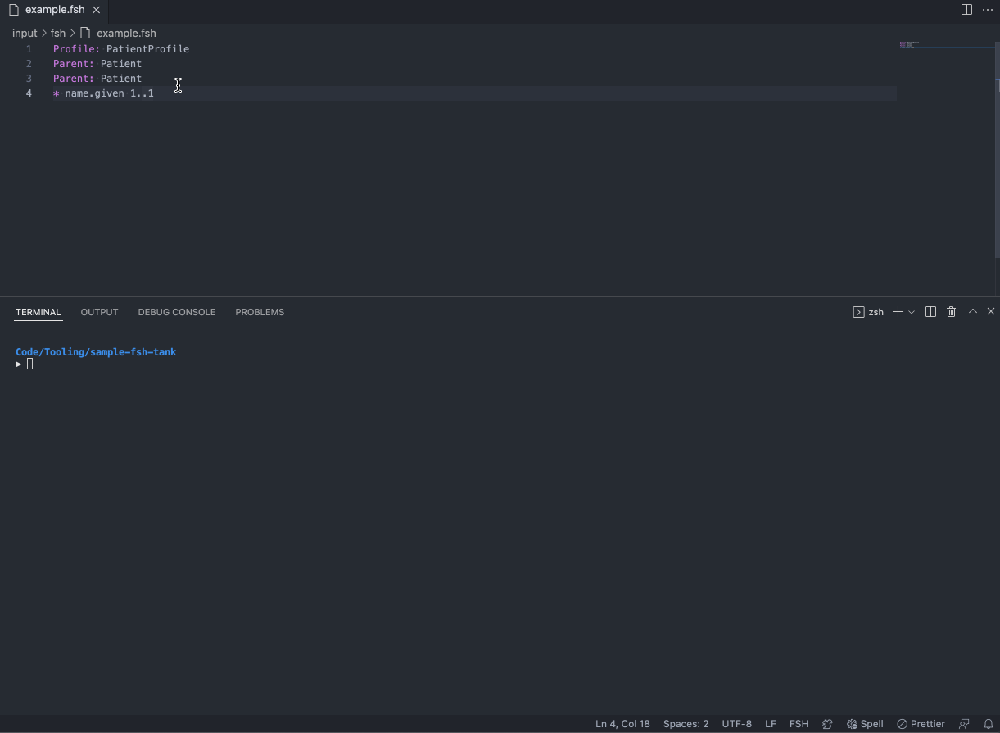

# FSH Language Support for VS Code

A language support extension for the FHIR Shorthand (FSH) language.

## FHIR Foundation Project Statement

- Maintainers: This project is maintained by the HL7 community.
- Issues / Discussion: For FSH Language Extension for VS Code issues, such as bug reports, comments, suggestions, questions, and feature requests, visit [FSH Language Extension for VS Code GitHub Issues](https://github.com/standardhealth/vscode-language-fsh/issues). For discussion of FHIR Shorthand and its associated projects, visit the FHIR Community Chat @ https://chat.fhir.org. The [#shorthand stream](https://chat.fhir.org/#narrow/stream/215610-shorthand) is used for all FHIR Shorthand questions and discussion.
- License: All contributions to this project will be released under the Apache 2.0 License, and a copy of this license can be found in [LICENSE](LICENSE).
- Contribution Policy: The FSH Language Extension for VS Code Contribution Policy can be found in [CONTRIBUTING.md](CONTRIBUTING.md).
- Security Information: The FSH Language Extension for VS Code Security Information can be found in [SECURITY.md](SECURITY.md).
- Compliance Information: This extension offers autocompletion capabilities that use FHIR R4, FHIR R4B, and FHIR R5 definitions. Definitions from previous versions of FHIR are not used by this extension.

## How to Download

In Visual Studio Code, go to the VS Code Extension Marketplace and download the
`vscode-fsh` extension. Once activated, this extension's features should
be automatically implemented.

## Language Features

### Syntax Highlighting



FSH files automatically have syntax highlighting applied. This allows for easier reading and writing of FHIR Shorthand.

## Snippets



FSH Snippets make creating new FSH items a breeze! Snippets automatically add relevant keywords and placeholders so you can easily
enter all of the recommended metadata for a FSH definition. Snippets will even auto-create your `Id` and `Title` for you based on the
name.

To use snippets, type one of the trigger phrases, hit the &lt;TAB&gt; or &lt;ENTER&gt; key, type in the first field value, and hit
the &lt;TAB&gt; key to move to the next placeholder. All FSH snippets always stop at the first rule in the definition.

| Trigger | FSH Item   | Keywords                                                        |
| ------- | ---------- | --------------------------------------------------------------- |
| `pro`   | Profile    | Profile, Parent, Id (auto), Title (auto), Description           |
| `ext`   | Extension  | Extension, Id (auto), Title (auto), Description                 |
| `log`   | Logical    | Logical, Parent, Id (auto), Title (auto), Description           |
| `res`   | Resource   | Resource, Parent (choice), Id (auto), Title (auto), Description |
| `vs`    | ValueSet   | ValueSet, Id (auto), Title (auto), Description                  |
| `cs`    | CodeSystem | CodeSystem, Id (auto), Title (auto), Description                |
| `inst`  | Instance   | Instance, InstanceOf, Usage (choice), Title (auto), Description |
| `inv`   | Invariant  | Invariant, Description, Expression, Severity (choice), XPath    |
| `map`   | Mapping    | Mapping, Source, Target, Id, Title (auto), Description          |
| `rs `   | RuleSet    | RuleSet                                                         |

Additionally, a snippet is provided to help when writing slicing rules. When the start of the phrase `^slicing` is detected, a block of rules can be inserted for the paths commonly set when defining slicing on an element.

## Enhanced Autocomplete

FSH entity definitions have their names provided as autocomplete results in contextually appropriate scenarios.

- After the `Parent` keyword, results will include `Profile`, `Extension`, `Logical`, and `Resource` names depending on the type of entity being defined.
- After the `InstanceOf` keyword, results will include `Profile`, `Extension`, and `Resource` names.
- When writing an `obeys` rule, results will include `Invariant` names.

When writing rules that apply to an element, element paths will be suggested. This feature is still undergoing development, so there are some known limitations to this feature:

- Completion items are only provided for rules on a `Profile`, `Extension`, `Logical`, `Resource`, or `Instance`.
- Slice names are not included as part of completion items.
- Completion items are not provided for indented rules.
- If a type is removed from a choice element with an `only` rule, completion items will still be offered for the removed types.
- Elements added to a `Logical` or `Resource` by a FSH rule will not be available as completion items for other rules.
- Only the main element path will have completion items provided. A caret rule will not have completion items provided for the caret path.

## Go to Definition



FSH entity definitions within your workspace can be found from anywhere their name is used. To go to the entity definition, right-click on the entity name and select "Go to Definition" from the context menu. Or, you can press &lt;F12&gt; when your text cursor is on the entity name.

## Open FHIR Documentation



Documentation pages can be opened directly from your FSH files. Right-click on the name of any FHIR resource or FSH keyword, and select "Open FHIR Documentation" from the context menu.

## Tasks



The extension provides a custom task for running SUSHI on the current workspace. The task will run SUSHI on the workspace, log messages to VS Code's integrated Terminal tab, report any errors or warnings in VS Code's Problems tab, and highlight errors and warnings inline in the FSH file. Selecting an error or warning from the Problems tab will open the file the error is in.

Note that after any errors or warnings are resolved in the FSH, SUSHI must be run through the task to resolve them in the Problems tab and inline in the FSH file.

To run the SUSHI Build task, use VS Code's Run Task feature. The "Run Task" feature can be accessed in the "Terminal" menu by clicking "Run Task...". When the menu opens in VS Code, select 'fsh' and then select 'sushi'. The task can also be run using the keyboard shortcut for running build tasks, which is ⇧⌘B on Mac and Ctrl+Shift+B on Windows.

Note that you must have SUSHI installed locally in order for the task to run successfully. See [SUSHI Installation instructions](https://fshschool.org/docs/sushi/installation/) for help installing.

## Instructions for Developers

### Intro to FSH VS Code Extension Development

To learn more about the FSH VS Code Extension, watch the Knowledge Sharing Sessions for [Developing FSH Tools](https://vimeo.com/990594228/056b5c075f) (view the slides [here](https://confluence.hl7.org/display/FHIR/FSH+Knowledge+Sharing+Sessions?preview=/256509612/256514908/KSS%203%20-%20Developing%20FSH%20Tools.pdf)) and [Developing FSH VS Code Extension](https://vimeo.com/1008502402/e0d365dc49) (view the slides [here](https://confluence.hl7.org/display/FHIR/FSH+Knowledge+Sharing+Sessions?preview=/256509612/265095834/KSS%207%20-%20Developing%20FSH%20VS%20Code%20Extension.pdf)).
These sessions provide a technical overview of the codebase and summarize key concepts for developers.

### Compile and Run

- run `npm install` in this folder. This installs all necessary npm modules in both the
  client and server folder
- open VS Code on this folder.
- Switch to the Debug viewlet.
- Select `Extension` from the drop down.

### NPM Tasks

The following NPM tasks may be useful in development:

| Task                | Description                                                                             |
| ------------------- | --------------------------------------------------------------------------------------- |
| **build**           | compiles `src/**/*.ts` files to `out/**/*.js` files using the TypeScript compiler (tsc) |
| **build:watch**     | similar to _build_ but automatically builds when changes are detected in src files      |
| **lint**            | checks all src files to ensure they follow project code styles and rules                |
| **lint:fix**        | fixes lint errors when automatic fixes are available for them                           |
| **prettier**        | checks all src files to ensure they follow project formatting conventions               |
| **prettier:fix**    | fixes prettier errors by rewriting files using project formatting conventions           |
| **test**            | runs the test suite                                                                     |
| **check**           | runs all the checks performed as part of ci (lint, prettier, test)                      |

To run any of these tasks, use `npm run`. For example:

```sh
$ npm run build:watch
```

#### Note about testing

The `test` task will often (but not always) produce an error if it is run while VSCode is open. If you receive this error, close VSCode and run the task from the command line.

### Updating the Grammar

The `src/lang/` directory contains the FSH lexer and parser. When the FSH grammar changes, the files in this directory will need to be updated. These files are generated in the [SUSHI](https://github.com/FHIR/sushi) project by running ANTLR on the grammar definition files. The files are then copied from the SUSHI project to this project.
The files to copy are:

- FSH.tokens
- FSHLexer.tokens
- FSHLexer.js
- FSHListener.js
- FSHParser.js
- FSHVisitor.js

# Conversion from FHIR Json to FSH and from FSH to FHIR Json

Right clicking on a .FSH file and then select the opteion "FSH to FHIR JSON" from the context menu will convert this FSH file to a FHIR JSON file. The FHIR JSON file will be created in memory in a separate file tab.

Right clicking on a JSON file that contains a FHIR resource and then select the opteion "FHIR to FSH" from the context menu will convert this JSON FHIR file to a FSH file. The FSH file will be created in memory in a separate file tab.

# License

Copyright 2019-2024 Health Level Seven International

Licensed under the Apache License, Version 2.0 (the "License");
you may not use this file except in compliance with the License.
You may obtain a copy of the License at

    http://www.apache.org/licenses/LICENSE-2.0

Unless required by applicable law or agreed to in writing, software
distributed under the License is distributed on an "AS IS" BASIS,
WITHOUT WARRANTIES OR CONDITIONS OF ANY KIND, either express or implied.
See the License for the specific language governing permissions and
limitations under the License.